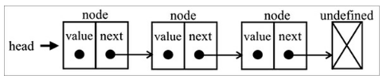
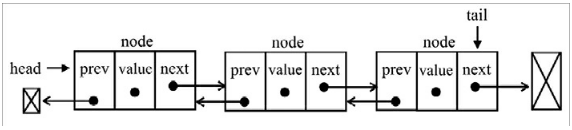
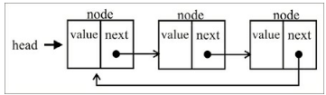
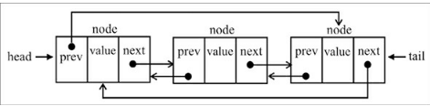

## Filas

Uma fila é uma coleção de items ordenados baesado em FIFO (First In First Out). A adição do novo elemento é feita na cauda, tail, e a remoção é feita na frente, head.

## Deque (Fila duplamente encadeada)

A estrutura de dados de deque, também conhecida como fila de duas pontas (double-ended queue), é uma fila especial que nos permite inserir e remover elementos do final ou da frente da fila.
Em ciência da computação, uma aplicação comum de um deque é na armazenagem de uma lista de operações para desfazer ações (undo). O Deque implementa tanto os princípios de FIFO como de LIFO.

## Listas Ligadas
Nas listas ligadas os elementos não são posicionados de forma contígua na memória.Cada elemento é constituído de um nó que contém o elemento propriamente dito, além de uma referência (ponteiro) que aponta para o próximo elemento.
Um vantagem é que não é preciso deslocar os elementos quando houver uma alteração na lista.

> Lista encadeada

## Listas duplamente ligadas

Nas listas duplamente ligadas temos a ligação de cada nó com o seu antecessor e seu nó sucessor.

> Lista duplamente encadeada

## Listas ligadas circulares

Elas podem ter apenas uma direção de referência ou uma referência dupla. A única diferença entre elas e a lista ligada é a presença de um ponteiro para o próximo item do último elemento faz referência ao head da lista.

> List circular

> List circular dupla

## Listas ligadas ordenadas

É uma lista que mantém todos os seus elementos ordenados, para manter todos eles ordenados, em vez de aplicar um algoritmo de inserção, fazemos a inserção do elemento na posiçao correta.

## Dicionários e Hashes
Em um dicionário (ou mapa), armazenamos valores em pares ` [chave, valor] `. O mesmo vale para Hashes
(armazenam valores em pares `[chave, valor]`), mas o modo como implementamos essas estruturas de dados é um pouco diferente, pois
os dicionários podem armazenar apenas um valor único por chave.
### Estrutura de dados de dicionário
O dicionário é usado para armazenar pares de chave-valor, em que a chave pode ser usada para encontrar um elemento em particular.
Um dicionário também é conhecido como `map`, tabela de símbolos e array associativo.

### Tabela Hash
O hashing consiste em econtrar um valor em uma estrutura de dados o mais rápido possível.
Quado usamos uma função de hash, já sabemos em que posição o valor se encontra, portanto podemos simplesmente o acessar.
Uma função de hash é uma função que, dada uma `key`, devolve o endereço em que o 
valor está na tabela.

A linguagem Javascript utiliza uma tabela hash internamente para representar cada objeto.
Nesse caso cada propriedade e cada método do objeto são armazenados como tipos de objeto `key`,
e cada  `key` aponta para o respectivo membro do objeto.

`Hash lose-lose` onde simplesmente soma-se os valores ASCII de cada caractere da chave.

### Tabela hash versus conjunto hash
Conjunto hash ou hash set, é uma estrutura de dados de um conjunto hash composta de um conjunto;
contudo, para inserir, remover ou acessar elementos, usamos uma função `hashCode`.
A diferença é que ao invés de adicionarmos um par chave-valor,apenas o valor será inserido.

### Tratando conlisões nas tabelas hash
Podemos ter o mesmo valor de hash, uma colisão, pois tentaremos atribuir diferentes pares chave-valor à mesma
 posição na instância de `HashTable`.

### Memoização
É uma técnica de otimização em que armazenamos os valores de resultados anteriores, de modo semelhante a um cache. 

<i>Anotações e Imagens retiradas do Ebook <b>Estruturas de Dados e Algoritmos com Javascript - Loiane Groner</b></i>.